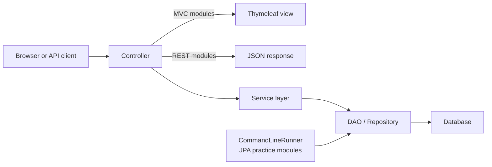
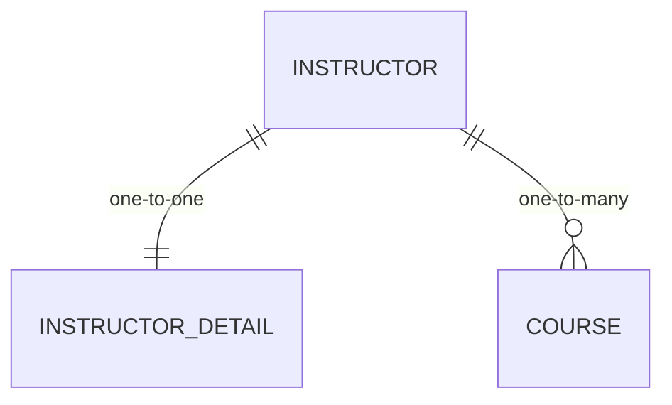

# Spring Tutorial Practice


This repository is a structured collection of Spring Boot practice projects organized as a learning journey. Rather than one production application, it brings together 28 standalone Maven examples that move from Spring Boot basics and Spring Core to JPA CRUD, REST APIs, MVC with Thymeleaf, validation, Spring Security, and advanced JPA relationship mapping.

- Topic-based learning path instead of one monolithic codebase
- Small, focused examples that are easy to run and compare
- Useful as a study guide, interview refresher, and hands-on Spring reference

> This is not a single multi-module build. Each sample project has its own `pom.xml` and `mvnw`, and the repository is meant to be explored one module at a time.

## What's Inside

The repository is grouped into 9 numbered topic sections, plus SQL helper folders for database-backed exercises. The sequence is intentional: it starts with lightweight Spring Boot web examples, then moves into dependency injection and bean configuration, then into persistence, REST, MVC, security, and relationship mapping.

At a glance, the repo contains:

- `28` standalone Maven projects
- `9` primary topic sections
- `Java 21` across the checked-in POMs
- `Spring Boot 3.5.12` and `3.5.13` across the examples
- SQL setup scripts for JPA, employee CRUD, and security-oriented modules

## Learning Roadmap

```mermaid
flowchart LR
    A["01-spring-boot-overview<br/>Boot basics, DevTools, Actuator, properties"] --> B["02-spring-boot-spring-core<br/>IoC, DI, qualifiers, scopes, lifecycle, Java config"]
    B --> C["03-hibernate-jpa-crud<br/>DAO-style JPA CRUD with Student"]
    C --> D["04-spring-boot-rest-crud<br/>REST basics, employee CRUD, Data JPA, Data REST"]
    D --> E["05-spring-boot-rest-security<br/>HTTP Basic security for REST CRUD"]
    E --> F["06-spring-boot-mvc<br/>Thymeleaf forms, model binding, validation"]
    F --> G["07-spring-boot-mvc-rest-crud<br/>Thymeleaf employee CRUD"]
    G --> H["08-spring-boot-spring-security<br/>Form login, JDBC users, role-based MVC security"]
    H --> I["09-spring-boot-jpa-advanced-mappings<br/>One-to-one and one-to-many JPA mappings"]
```



The numbered folders are already arranged in a practical study order, and most subfolders inside them continue that progression.

## Repository Structure

```text
.
├── 01-spring-boot-overview
│   ├── 01-spring-boot-demo
│   ├── 02-dev-tools
│   ├── 03-actuator-demo
│   ├── 04-actuator-security-demo
│   ├── 05-command-line-demo
│   └── 06-properties-demo
├── 02-spring-boot-spring-core
│   ├── 01-constructor-injection
│   ├── 02-component-scanning
│   ├── 03-setter-injection
│   ├── 04-qualifiers
│   ├── 05-primary
│   ├── 06-lazy-initialization
│   ├── 07-bean-scopes
│   ├── 08-bean-lifecycle-methods
│   └── 09-java-config-bean
├── 03-hibernate-jpa-crud
│   ├── 00-starter-sql-scripts
│   └── 01-cruddemo-student
├── 04-spring-boot-rest-crud
│   ├── 01-spring-boot-rest-crud
│   ├── 02-spring-boot-rest-crude-employee
│   ├── 03-spring-boot-rest-crude-employee-with-spring-boot-data-jpa
│   ├── 04-spring-boot-rest-crude-employee-with-spring-boot-data-rest
│   └── spring-boot-employee-sql-script
├── 05-spring-boot-rest-security
│   └── 05-spring-boot-rest-security
├── 06-spring-boot-mvc
│   ├── 01-thymeleafdemo-hello-world
│   └── validationdemo
├── 07-spring-boot-mvc-rest-crud
│   └── 00-spring-boot-spring-mvc-crud-starter-code
├── 08-spring-boot-spring-security
│   └── 01-spring-boot-spring-mvc-security
├── 09-spring-boot-jpa-advanced-mappings
│   ├── 00-jpa-advanced-mappings-database-scripts
│   ├── 01-jpa-one-to-one-uni
│   ├── 02-jpa-one-to-one-bi
│   └── 03-jpa-one-to-many
└── spring-mvc-security-jdbc
    └── sql-scripts
```

| Section | What it contains | Focus |
| --- | --- | --- |
| `01-spring-boot-overview` | 6 standalone apps | Starter web app setup, DevTools, Actuator, Actuator + Security, and externalized property examples |
| `02-spring-boot-spring-core` | 9 standalone apps | Constructor/setter injection, component scanning, qualifiers, `@Primary`, lazy initialization, bean scopes, lifecycle callbacks, and Java-based bean config |
| `03-hibernate-jpa-crud` | 1 app + starter SQL scripts | `Student` CRUD with a DAO layer and `CommandLineRunner`-driven persistence exercises |
| `04-spring-boot-rest-crud` | 4 apps + employee SQL script | REST basics, custom REST exception handling, employee CRUD, Spring Data JPA, and Spring Data REST |
| `05-spring-boot-rest-security` | 1 app + SQL scripts | Secured employee REST CRUD with JDBC-backed users and role-based authorization |
| `06-spring-boot-mvc` | 2 standalone apps | Thymeleaf hello-world/forms, model binding, and bean validation with a custom validator |
| `07-spring-boot-mvc-rest-crud` | 1 app + SQL scripts | Employee CRUD through a Spring MVC + Thymeleaf + service/repository stack |
| `08-spring-boot-spring-security` | 1 app + SQL scripts | Form login, custom login/access-denied views, JDBC security, and role-gated MVC routes |
| `09-spring-boot-jpa-advanced-mappings` | 3 apps + database scripts | One-to-one unidirectional, one-to-one bidirectional, and one-to-many JPA mappings |
| `spring-mvc-security-jdbc` | SQL scripts only | Standalone JDBC security setup scripts that complement the security-focused sections |

## Key Topics Covered

- Spring Boot web app setup and externalized configuration
- Spring Boot DevTools and Actuator
- Constructor injection and setter injection
- Component scanning and bean discovery
- `@Qualifier` and `@Primary`
- Lazy initialization, bean scopes, and lifecycle methods
- Java-based bean configuration with `@Configuration`
- DAO-based CRUD with JPA/Hibernate entities
- `CommandLineRunner`-driven persistence exercises
- REST controllers, path variables, JSON responses, and exception handling
- Employee CRUD with service and repository layers
- Spring Data JPA and Spring Data REST
- Thymeleaf templates, forms, model binding, and form processing
- Validation with built-in constraints plus a custom `@CourseCode` validator
- Spring Security for REST and MVC applications
- JDBC-backed authentication with `JdbcUserDetailsManager` and custom queries
- Role-based authorization rules for endpoints and pages
- JPA relationship mapping: one-to-one and one-to-many
- SQL scripts for schema creation and security table setup

## Tech Stack

| Area | Verified in this repository |
| --- | --- |
| Language and build | Java 21, Maven, Maven Wrapper (`mvnw`) in all 28 sample apps |
| Spring Boot | Spring Boot `3.5.12` and `3.5.13` |
| Core web stack | Spring Web, Spring Boot DevTools, Spring Boot Actuator |
| Persistence | Spring Data JPA, Hibernate/JPA, MySQL Connector/J |
| Additional database driver | PostgreSQL driver in `03-hibernate-jpa-crud/01-cruddemo-student` |
| REST extras | Spring Data REST in selected CRUD modules |
| MVC stack | Thymeleaf, Thymeleaf Extras Spring Security 6 |
| Validation | Spring Boot Validation / Jakarta Validation |
| Security | Spring Security, HTTP Basic, form login, JDBC-backed user details |
| API documentation | `springdoc-openapi-starter-webmvc-ui` in selected CRUD modules |

## Architecture / Request Flow

The web-oriented examples in this repo generally follow a layered Spring structure, while the JPA practice modules under `03-hibernate-jpa-crud` and `09-spring-boot-jpa-advanced-mappings` trigger their work from `CommandLineRunner`.



## JPA Relationships

The advanced mapping section is centered on `Instructor`, `InstructorDetail`, and `Course` entities. The implemented projects cover:

- `01-jpa-one-to-one-uni`: unidirectional one-to-one mapping
- `02-jpa-one-to-one-bi`: bidirectional one-to-one mapping
- `03-jpa-one-to-many`: `Instructor` to `Course`
- `00-jpa-advanced-mappings-database-scripts`: additional schema folders for one-to-many uni and many-to-many setups



## How to Run the Examples

Because this repo is a collection of independent sample apps, you run each example from its own folder.

```bash
cd 01-spring-boot-overview/01-spring-boot-demo
./mvnw spring-boot:run
```

```bash
cd 06-spring-boot-mvc/validationdemo
./mvnw spring-boot:run
```

```bash
cd 09-spring-boot-jpa-advanced-mappings/03-jpa-one-to-many
./mvnw spring-boot:run
```

Helpful notes:

- There is no root-level unified run command or parent `pom.xml` for the whole repository.
- Database-backed modules read connection settings from their own `src/main/resources/application.properties`.
- SQL setup files live in nearby folders such as `00-starter-sql-scripts`, `spring-boot-employee-sql-script`, `sql-scripts`, and `00-jpa-advanced-mappings-database-scripts`.
- The REST CRUD modules are controller-based examples; the Data REST sample additionally configures a base path at `/magic-api`.
- Selected CRUD modules also customize springdoc paths such as `/my-ui.html` and `/my-api-docs`.
- The JPA modules under `03-hibernate-jpa-crud` and `09-spring-boot-jpa-advanced-mappings` are best understood through console output and database changes after startup.
- On Windows, use `mvnw.cmd spring-boot:run` instead of `./mvnw spring-boot:run`.

## Recommended Learning Order

1. Start with `01-spring-boot-overview` to get comfortable with Spring Boot app structure and configuration.
2. Move to `02-spring-boot-spring-core` for IoC, dependency injection, bean selection, and lifecycle concepts.
3. Continue with `03-hibernate-jpa-crud` for foundational entity persistence and DAO-based CRUD.
4. Explore `04-spring-boot-rest-crud` to see how the same domain ideas are exposed through REST endpoints.
5. Add authorization concerns with `05-spring-boot-rest-security`.
6. Switch to `06-spring-boot-mvc` for Thymeleaf views, forms, and validation.
7. Apply those MVC ideas to database-backed CRUD in `07-spring-boot-mvc-rest-crud`.
8. Study form login and JDBC-backed role handling in `08-spring-boot-spring-security`.
9. Finish with `09-spring-boot-jpa-advanced-mappings` for deeper relationship modeling.

Inside each section, follow the numbered subfolders in order when possible.

## Why This Repo Is Useful

- It isolates concepts into small projects, which makes it easier to learn one Spring topic at a time.
- It shows a clear progression from fundamentals to more advanced persistence and security topics.
- It doubles as an interview-prep checklist for common Spring Boot, JPA, REST, MVC, and Security concepts.
- It is practical to revisit: open a folder, inspect the POM, run the sample, and compare it with the next step in the sequence.

If you are learning Spring Boot hands-on, this repository works best as a guided lab notebook: move in order, run each module locally, and use the SQL/script folders when you reach the database-backed sections.
